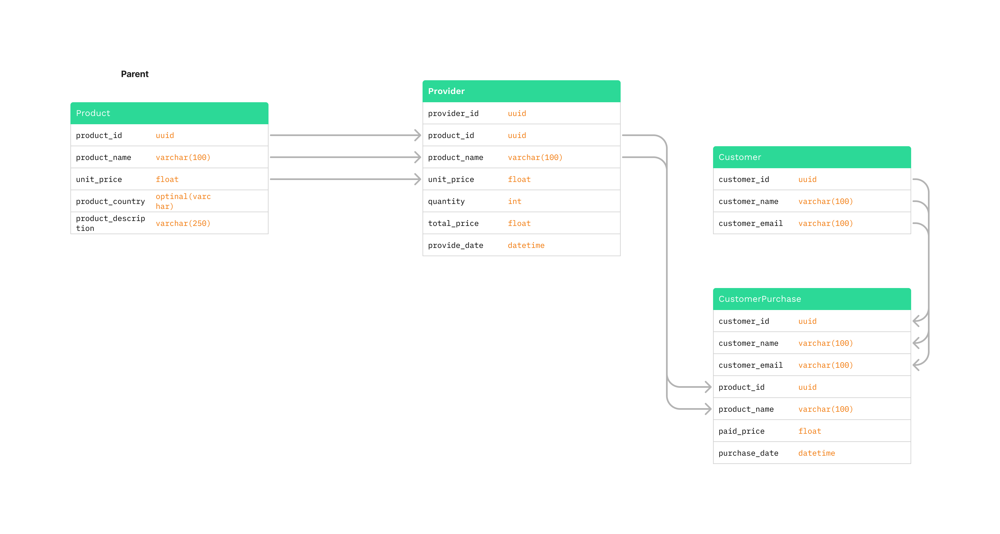

# Online Grocery Store 
Online grocery store app with using FastAPI, SQLAlchemy, Pydantic, PostgreSQL, and Alembic

# How to run project
1. Install dependencies in the `requirements.txt` file
2. Create `.env` file with specifying `DB_NAME` and `DB_URL`
3. Create database based on alembic revision `alembic upgrade head`
4. `./run.sh` in terminal

# Project diagram [WIP]

# Resources:
- Used project examples:
  - https://www.patrick-muehlbauer.com/articles/fastapi-with-sqlalchemy
  - https://github.com/tiangolo/full-stack-fastapi-postgresql
- Used for **Alembic** migrations: https://www.compose.com/articles/schema-migrations-with-alembic-python-and-postgresql/
- SQLAlchemy article series: https://hackersandslackers.com/tag/sqlalchemy/
- SQLAlchemy Relationships:
  - https://docs.sqlalchemy.org/en/14/orm/basic_relationships.html - Official
  - https://www.digitalocean.com/community/tutorials/how-to-use-one-to-many-database-relationships-with-flask-sqlalchemy
  - https://www.youtube.com/watch?v=VVX7JIWx-ss - YouTube tutorial
- Used for setting up alembic `env.py`: https://alembic.sqlalchemy.org/en/latest/api/config.html
- Used for `update_products` endpoint https://pydantic-docs.helpmanual.io/usage/exporting_models/#modeldict
  - Convert pydantic model a dict and pass `exclude_unset=True` to not including fields that are not explicitly set
- Creating UUIDs in Postman: https://gist.github.com/rajbharath/5f37827031692845cf87